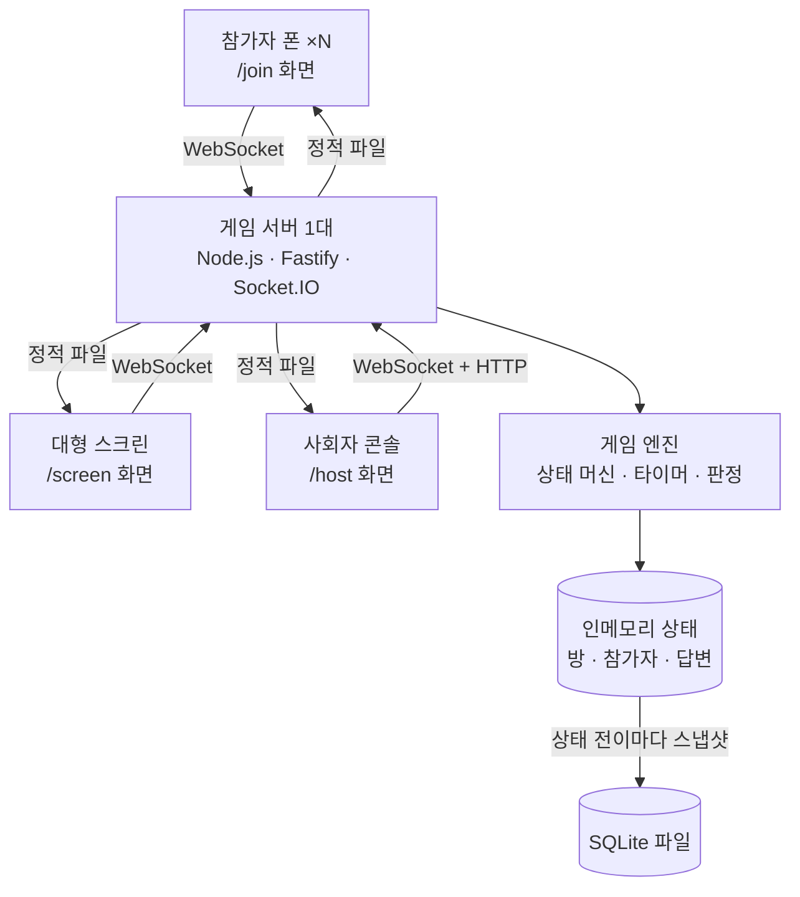
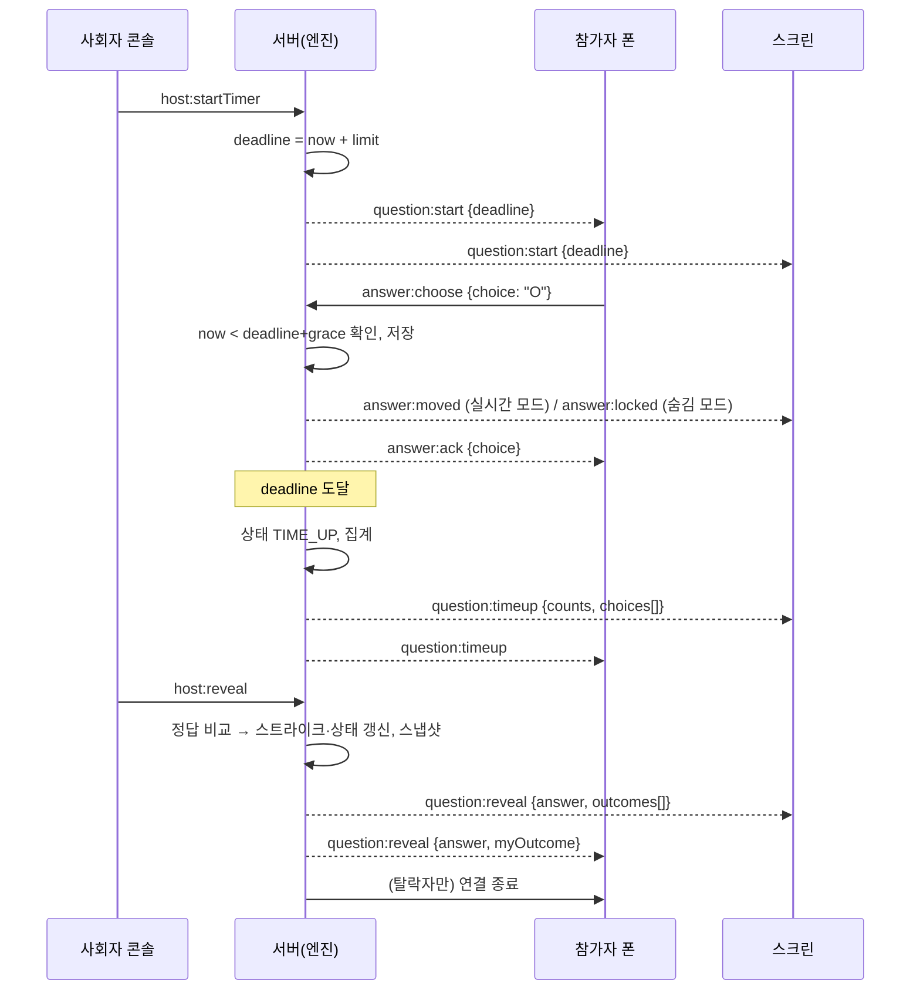

# 아키텍처 설계

## 전체 구조



서버는 한 대다. 하나의 Node 프로세스가 (1) 빌드된 SPA 정적 파일을 서빙하고, (2) Socket.IO로 세 종류의 클라이언트와 실시간 통신하며, (3) 게임 엔진이 유일한 진실의 원천(source of truth)으로 방 상태를 인메모리에 들고 있다. 클라이언트는 상태를 계산하지 않고 서버가 보내주는 상태를 그대로 그린다. 상태가 바뀔 때마다 SQLite에 스냅샷을 남겨 서버가 죽어도 마지막 상태에서 복구한다([[ADR-0002-single-instance-state]]). 세 클라이언트는 하나의 React SPA 안의 라우트 셋이며, 접속 시 어떤 역할인지 서버에 알린 뒤 각자 Socket.IO 룸(`players`, `screen`, `host`)에 들어간다. 참가자 폰은 큰 화면을 그리지 않으므로 받는 이벤트가 적고, 스크린은 아바타 이동 이벤트를 받되 이동 숨김 모드의 문제에서는 마감 전까지 선택 방향을 받지 못한다([[game-flow]] 이동 표시 모드).

## 구성 요소

| 컴포넌트 | 책임 | 상세 |
|---|---|---|
| 게임 엔진 (`engine/`) | 방 상태 머신, 답변 수집·마감 판정, 스트라이크 계산, 되돌리기. 순수 함수 위주로 짜서 단위 테스트 가능하게 | [[game-flow]] |
| 실시간 게이트웨이 (`ws/`) | Socket.IO 연결 인증(세션 토큰·호스트 PIN), 룸 배정, 이벤트 검증, 브로드캐스트 | [[realtime-protocol]] |
| 타이머 서비스 | 서버 시각 기준 마감 시각을 정하고 `setTimeout`으로 TIME_UP 전이. 클라이언트는 마감 시각만 받아 각자 카운트다운 | [[game-flow]] |
| 참가자 레지스트리 | 전화번호 정규화·중복 검사, 세션 토큰 발급, 재접속 매칭 | [[ADR-0003-phone-identity]] |
| 영속화 (`store/`) | SQLite(better-sqlite3)에 방·참가자·문제·답변·라운드 결과 저장, 기동 시 복구, 보관 기간 지난 전화번호 삭제 | [[data-model]] |
| 참가자 앱 (`/join`) | 입장 폼, 로비 대기, O/X 버튼, 결과·탈락 화면. 가볍고 터치 우선 | [[screens]] |
| 스크린 앱 (`/screen`) | DOM(React 컴포넌트 + CSS transform) 위에 무대·구역·아바타 렌더링, 이동·유휴 애니메이션, 이동 숨김 모드 배지, 타이머·집계·정답·우승 연출, QR 코드 | [[screens]] |
| 사회자 콘솔 (`/host`) | 문제 등록·편집, 입장 관리, 진행 버튼, 참가자 목록·복구·퇴장, CSV 내보내기 | [[screens]] |
| 문제 가져오기 | CSV/JSON 파싱과 검증(정답은 O/X만, 제한시간 범위) | [[data-model]] |

## 주요 흐름 — 한 문제의 답변과 판정



핵심은 **마감 판정을 서버만 한다**는 점이다. 클라이언트의 카운트다운은 표시용이며, 서버 마감 시각 이후 도착한 답은 유예 시간(기본 300ms) 안에서만 받아준다. 스크린은 참가자별 이동 이벤트를 받아 아바타를 걷게 하고, 참가자 폰은 자기 선택의 확인(ack)만 받는다. 이동 숨김 모드(기본 5번 문제부터)에서는 서버가 스크린에 선택 방향을 보내지 않고 마감 시점에 한꺼번에 보내므로, 공개 화면에서 선택이 새는 경로가 프로토콜 수준에서 없다.

## 시각 동기화

- 클라이언트는 접속 직후와 주기적으로 `time:ping`을 보내 서버 시각과의 오프셋을 추정한다(왕복 지연의 절반 보정).
- `question:start`에는 마감 시각의 **서버 절대 시각**이 들어간다. 클라이언트는 `deadline - (now + offset)`으로 남은 시간을 그린다. 이렇게 하면 이벤트가 늦게 도착해도 카운트다운이 밀리지 않는다.

## 기술 선택

| 영역 | 선택 | 이유 | 대안 |
|---|---|---|---|
| 런타임 | Node.js 22 + TypeScript | 프론트와 언어 통일, Socket.IO 생태계 | Go(성능은 남지만 인력 1명에 언어 둘은 부담), Python FastAPI(WebSocket 룸·재접속을 직접 짜야 함) |
| HTTP 서버 | Fastify | 빠르고 정적 파일·플러그인 간단 | Express(느리지만 가능), Next.js(Socket.IO와 궁합이 나쁨) |
| 실시간 | Socket.IO | 룸, 자동 재접속, 폴링 폴백, 확인 응답 내장 | 순수 `ws`, Supabase Realtime, Firebase → [[ADR-0001-realtime-socketio]] |
| 상태 | 인메모리 + SQLite 스냅샷 | 단일 인스턴스면 가장 단순하고 빠름 | Redis, Postgres → [[ADR-0002-single-instance-state]] |
| 프론트 | React 19 + Vite + TypeScript | 세 화면을 라우트로 한 번에, 빌드 결과를 서버가 서빙 | Svelte(가벼움, 익숙도 문제), 순수 JS |
| 스크린 렌더링 | DOM (React 컴포넌트 + CSS transform/transition) | 참가자 약 50명(상한 100명)이면 DOM으로 60fps가 나오고, 스타일링·디버깅이 쉽고 의존성이 없음. 색종이·연기 파티클만 `canvas-confetti` 사용 | PixiJS 8(200명을 넘으면 재검토), Canvas 2D 직접, Phaser(게임 엔진은 과함) |
| 아바타 그림 | 조합형 SVG/PNG 파츠(몸 색 × 얼굴 × 머리) 시드 기반 | 저작권 걱정 없이 수백 종 조합, 참가자가 바꿀 수 있음 | DiceBear API(외부 의존), 외부 캐릭터 이미지(저작권) |
| QR | `qrcode` npm | 서버 또는 스크린에서 즉시 생성 | 외부 QR 서비스 |
| 배포 | GCP Cloud Run 단일 인스턴스 | 기존 배포 경험·스킬 활용, 공개 URL. 행사장에 인터넷이 없어 노트북은 휴대폰 핫스팟, 참가자는 QR로 접속해 자기 데이터 사용 | 현장 노트북 LAN(핫스팟 접속 대수 제한으로 폐기), VM → [[ADR-0004-cloud-deploy]] |

되돌리기 어려운 선택은 [[index|ADR 목록]]에 따로 기록했다.

## 폴더 구조 (안)

```
ox-quiz/
├── server/            # Fastify + Socket.IO + 엔진 + SQLite
│   ├── engine/        # 상태 머신, 판정 (순수 함수, 테스트 대상)
│   ├── ws/            # 이벤트 핸들러, 인증, 룸
│   ├── store/         # SQLite 스키마, 스냅샷, 복구
│   └── index.ts
├── web/               # React SPA (Vite)
│   ├── src/join/      # 참가자 화면
│   ├── src/screen/    # 대형 스크린 (DOM + CSS 애니메이션)
│   ├── src/host/      # 사회자 콘솔
│   └── src/shared/    # 이벤트 타입(서버와 공유), 시각 동기화 훅
├── shared/            # 서버·웹 공용 타입과 상수 (이벤트 이름, 페이로드 스키마)
├── DOCS/              # 이 볼트
└── Dockerfile
```

## 열린 질문

> [!tip] 결정 (2026-09-16)
> 참가자가 약 50명으로 확정되어 스크린 렌더링은 PixiJS 대신 DOM으로 단순화했다. 인원이 200명을 넘게 바뀌면 재검토한다.

> [!question] 확인 필요
> - 효과음·배경음 파일을 어디서 조달할지(무료 라이선스 확인)는 미정이다.
