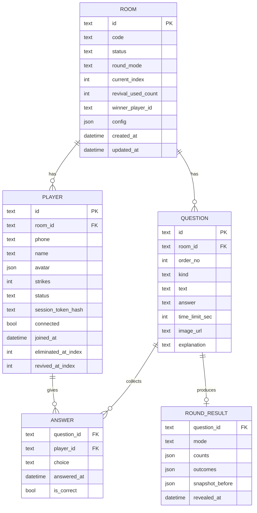

# 데이터 모델

인메모리 객체가 진행 중의 진실이고, SQLite는 같은 구조를 그대로 눕힌 영속 사본이다. 상태 전이(입장, 답변 마감, 정답 공개, 되돌리기)마다 트랜잭션 하나로 기록한다. 답변 개별 접수는 인메모리에만 쌓고 마감 시점에 일괄 저장해 쓰기 횟수를 줄인다.

## 엔티티 관계



## 스키마

### rooms

| 필드 | 타입 | 제약 | 설명 |
|---|---|---|---|
| `id` | TEXT | PK, ULID | 내부 식별자 |
| `code` | TEXT | UNIQUE, 4~6자 대문자·숫자(혼동 문자 0/O/1/I 제외) | QR·URL에 실리는 방 코드 |
| `status` | TEXT | `LOBBY \| LOCKED \| QUESTION_SHOWN \| ANSWERING \| TIME_UP \| REVEALED \| ENDED` | [[game-flow]] 방 상태 |
| `round_mode` | TEXT | `NORMAL \| REVIVAL`, NULL 허용 | 진행 중 라운드의 모드. 라운드 밖(`LOBBY`·`LOCKED`·`ENDED`)에서는 NULL → [[game-flow]] 라운드 모드 |
| `current_index` | INTEGER | 기본 -1 | 진행 중 문제의 `order_no`. 시작 전 -1 |
| `deadline_at` | INTEGER | NULL 허용 | `ANSWERING`일 때 마감 서버 시각(ms). 복구 시 신뢰하지 않음 |
| `config` | JSON | | `{ defaultTimeLimitSec: 15, maxStrikes: 2, revivalAfterOrderNo: 4, liveMovesUntilOrderNo: 3, answerGraceMs: 300, answerRateLimitMs: 300, autoStart: true, autoStartDelaySec: 3 }`. `autoStart`·`autoStartDelaySec`는 문제 공개 뒤 타이머 자동 시작 여부와 준비 카운트(초). `revivalAfterOrderNo`는 패자부활전 예정 시점(이 `order_no` 문제의 정답 공개 뒤, 0부터 세므로 콘솔에는 5번으로 표시), 기본값은 문제 수의 절반 지점. `liveMovesUntilOrderNo`는 아바타 이동을 실시간으로 보여주는 마지막 문제(콘솔에는 4번까지로 표시), 그 뒤 문제는 숨김 모드. 둘 다 언제든 변경 가능. 미응답=오답은 규칙이므로 설정이 없다 |
| `revival_used_count` | INTEGER | 기본 0 | 패자부활전을 연 횟수. 1 이상이면 추가 부활전은 `force` 필요 |
| `pending_revival` | INTEGER | 0/1 | 생존자가 결승 인원 이하인데 부활전을 아직 안 열어 다음 단계가 부활전인 상태 → [[game-flow]] 결승 규칙 |
| `finale_at` | INTEGER | NULL 허용 | 결승 발표(ENDED) 자동 전환 예정 시각. 재시작 시 신뢰하지 않음(예약 자체는 메모리) |
| `config.finalistThreshold` | (config JSON) | 기본 3 | 결승 진출 인원. 0이면 규칙 끔 |
| `config.chatEnabled` | (config JSON) | 기본 true | 참가자 채팅 허용. 채팅 내용 자체는 저장하지 않고 서버 메모리에 최근 200건만 둔다 |
| `config.lockCountdownSec` | (config JSON) | 기본 10 | 입장 마감 카운트다운(초). 0이면 즉시 마감 |
| `config.practiceUntilOrderNo` | (config JSON) | 기본 0 | 이 order_no까지는 맛보기 문제(틀려도 스트라이크 없음). -1이면 맛보기 없음 |
| `config.answerGraceMs` | (config JSON) | 기본 1000 | 마감 유예. 서버는 이만큼 기다렸다가 집계한다 |
| `lock_at` | (저장 안 함) | — | 마감 카운트다운 예정 시각. 예약이 메모리에만 있어 재시작하면 null |
| `winner_player_id` | TEXT | NULL 허용, FK players | 오프라인 결승 뒤 사회자가 지정한 우승자. `ENDED`에서만 채움 |
| `created_at`, `updated_at` | TEXT | ISO 8601 | |

### players

| 필드 | 타입 | 제약 | 설명 |
|---|---|---|---|
| `id` | TEXT | PK, ULID | 스크린·이벤트에 노출되는 식별자. 전화번호와 무관 |
| `room_id` | TEXT | FK rooms | |
| `phone` | TEXT | `UNIQUE(room_id, phone)`, 숫자만 10~11자리 | 정규화된 휴대폰 번호. 콘솔과 CSV 외에는 절대 노출 안 함. 행사 후 NULL로 삭제 |
| `name` | TEXT | 1~12자, 공백 정리 | 이름 또는 별명. 중복 허용(식별은 phone) |
| `avatar` | JSON | | `{ body: 0-11, face: 0-7, hair: 0-9 }` |
| `strikes` | INTEGER | 0 이상 | 오답 횟수 |
| `status` | TEXT | `ACTIVE \| WAITING \| ELIMINATED` | [[game-flow]] 참가자 상태. `strikes`로부터 파생되지만 수동 복구 때문에 따로 저장 |
| `session_token_hash` | TEXT | | 세션 토큰 SHA-256. 원문은 참가자 폰 localStorage에만 |
| `connected` | INTEGER | 0/1 | 소켓 연결 여부. 재시작 후엔 0으로 초기화 |
| `joined_at` | TEXT | | |
| `eliminated_at_index` | INTEGER | NULL 허용 | 탈락한 문제 번호. CSV·최종 화면용 |
| `revived_at_index` | INTEGER | NULL 허용 | 패자부활전으로 복귀한 문제 번호. 부활자 표시·통계용 |
| `consent_at` | TEXT | NOT NULL | 개인정보 수집 동의 시각 |

### questions

| 필드 | 타입 | 제약 | 설명 |
|---|---|---|---|
| `id` | TEXT | PK, ULID | |
| `room_id` | TEXT | FK rooms | |
| `order_no` | INTEGER | `UNIQUE(room_id, order_no)`, 0부터 | 출제 순서. 콘솔에서 재정렬 가능(`LOBBY`/`LOCKED`에서만) |
| `kind` | TEXT | `NORMAL \| REVIVAL`, 기본 `NORMAL` | 패자부활전용으로 준비한 문제 표시. 출제 시 사회자가 모드를 바꿀 수 있으므로 "제안"일 뿐 강제는 아님 |
| `used_at` | TEXT | NULL 허용 | 출제된 시각. NULL이면 미출제. 모드와 무관하게 한 번 낸 문제는 소진 |
| `text` | TEXT | 1~200자 | 지문 |
| `answer` | TEXT | `O \| X` | 정답. 사회자 룸 외로는 `REVEALED` 전에 절대 전송하지 않음 |
| `time_limit_sec` | INTEGER | 5~120, NULL이면 방 기본값 | |
| `image_url` | TEXT | NULL 허용 | 서버에 업로드한 이미지 경로 또는 외부 URL |
| `explanation` | TEXT | NULL 허용 | 정답 공개 후 스크린에 띄울 해설 |

### answers

| 필드 | 타입 | 제약 | 설명 |
|---|---|---|---|
| `question_id` | TEXT | FK, `PK(question_id, player_id)` | |
| `player_id` | TEXT | FK | |
| `choice` | TEXT | `O \| X \| NULL` | NULL = 미응답 |
| `answered_at` | INTEGER | 서버 시각(ms) | 마지막 선택 시각 |
| `change_count` | INTEGER | | 선택을 바꾼 횟수(통계용) |
| `is_correct` | INTEGER | 0/1, NULL | 정답 공개 시 채움 |

한 문제에 한 참가자는 한 행이다. 선택을 바꾸면 인메모리에서 덮어쓰고, `TIME_UP` 시점에 전원 분(미응답 포함)을 한 트랜잭션으로 저장한다.

### round_results

| 필드 | 타입 | 제약 | 설명 |
|---|---|---|---|
| `question_id` | TEXT | PK, FK | |
| `mode` | TEXT | `NORMAL \| REVIVAL` | 이 라운드가 어떤 모드로 출제되었는지 |
| `counts` | JSON | | `{ O, X, none }` — 자격자만 집계 |
| `outcomes` | JSON | | `[{ playerId, choice, correct, strikesAfter, statusAfter, revived }]` — [[realtime-protocol]]의 `Outcome[]` 그대로. 자격자만 포함 |
| `snapshot_before` | JSON | | 정답 공개 직전의 `players` 전원 `{ id, strikes, status }`. `host:undoReveal`이 이걸로 복원 |
| `revealed_at` | TEXT | | |
| `undone` | INTEGER | 0/1 | 되돌린 라운드 표시. 같은 문제를 다시 공개하면 새 행으로 덮어씀 |

### images (문제 사진)

| 필드 | 타입 | 제약 | 설명 |
|---|---|---|---|
| `id` | TEXT | PK, UUID | `imageUrl = /api/images/<id>` |
| `mime` | TEXT | `image/jpeg \| png \| webp \| gif` | |
| `bytes` | BLOB | 3MB 이하(콘솔이 1280px로 줄여 보통 100~300KB) | |
| `size` | INTEGER | | |
| `created_at` | INTEGER | | |

방 상태(`RoomState`)에 넣지 않고 따로 둔다. 상태를 `structuredClone`할 때 바이너리가 복사되지 않게 하기 위해서고, 전체 교체 저장(`save`)에서도 지우지 않는다. 게임 초기화 뒤에도 문제가 사진을 참조하므로 남겨 둔다. SQLite 파일에 들어 있어 GCS 스냅샷에 함께 복사된다.

## 인메모리 구조와 SQLite의 관계

```ts
type RoomState = {
  room: Room;
  players: Map<PlayerId, Player>;          // phone → id 역색인 별도 유지
  questions: Question[];                   // order_no 정렬
  currentAnswers: Map<PlayerId, Answer>;   // ANSWERING 중에만 채움, TIME_UP에 일괄 저장
  roundResults: Map<QuestionId, RoundResult>;
  timers: { deadline?: NodeJS.Timeout };
};
```

| 시점 | SQLite 쓰기 |
|---|---|
| 입장 | `players` INSERT |
| 상태 전이 전부 | `rooms.status/current_index/deadline_at` UPDATE |
| `TIME_UP` | `answers` 일괄 INSERT (전원) |
| `QUESTION_SHOWN` | `rooms.round_mode/current_index` UPDATE, `questions.used_at` UPDATE |
| `REVEALED` | `players.strikes/status/eliminated_at_index/revived_at_index` UPDATE + `round_results` INSERT, 한 트랜잭션 |
| `undoReveal` | `snapshot_before`로 `players` UPDATE, `round_results.undone=1` |
| 기동 | 전 테이블 SELECT → `RoomState` 재구성. `ANSWERING`이면 같은 `round_mode`의 `QUESTION_SHOWN`으로 강등 |

## 인덱스와 조회 패턴

| 조회 | 인덱스 | 빈도 |
|---|---|---|
| 전화번호로 참가자 찾기(입장·재접속) | `UNIQUE(room_id, phone)` | 입장 시, 재접속 시 |
| 세션 토큰으로 참가자 찾기 | `INDEX(session_token_hash)` | 소켓 연결마다 |
| 방 코드로 방 찾기 | `UNIQUE(code)` | 입장 시 |
| 문제 순서 조회 | `UNIQUE(room_id, order_no)` | 문제 전환 시 |
| 나머지 | 없음 — 인메모리에서 처리 | |

## 개인정보 처리

> [!warning] 주의
> `players.phone`은 이 시스템에서 유일한 개인정보다. 다음을 지킨다.
> - 스크린·참가자 이벤트에 절대 포함하지 않는다. `PublicPlayer` 타입에 필드 자체가 없다. **유일한 예외**: 게임 종료 시 결승 진출자(기본 3명 이하)의 뒷번호 4자리(`Finalist.phoneTail`)를 무대 호명용으로 스크린에 띄운다(사회자 결정, 2026-09-17).
> - 서버 로그에 남기지 않는다(요청 본문 로깅 금지).
> - `POST /api/host/purge-phones`로 `phone`을 NULL로 바꾸고, 기동 시 `created_at`이 보관 기간(기본 7일)을 넘은 방은 자동으로 같은 처리를 한다.
> - 백업 파일(SQLite)을 복사해 두었다면 그것도 같이 지워야 한다. 운영 체크리스트에 넣는다([[roadmap]]).

## 마이그레이션 고려사항

첫 버전이므로 기존 데이터가 없다. 스키마 버전을 `PRAGMA user_version`에 기록하고, 기동 시 버전이 낮으면 순서대로 마이그레이션 SQL을 적용한다. 행사 도중 스키마를 바꾸는 일은 없어야 한다.
