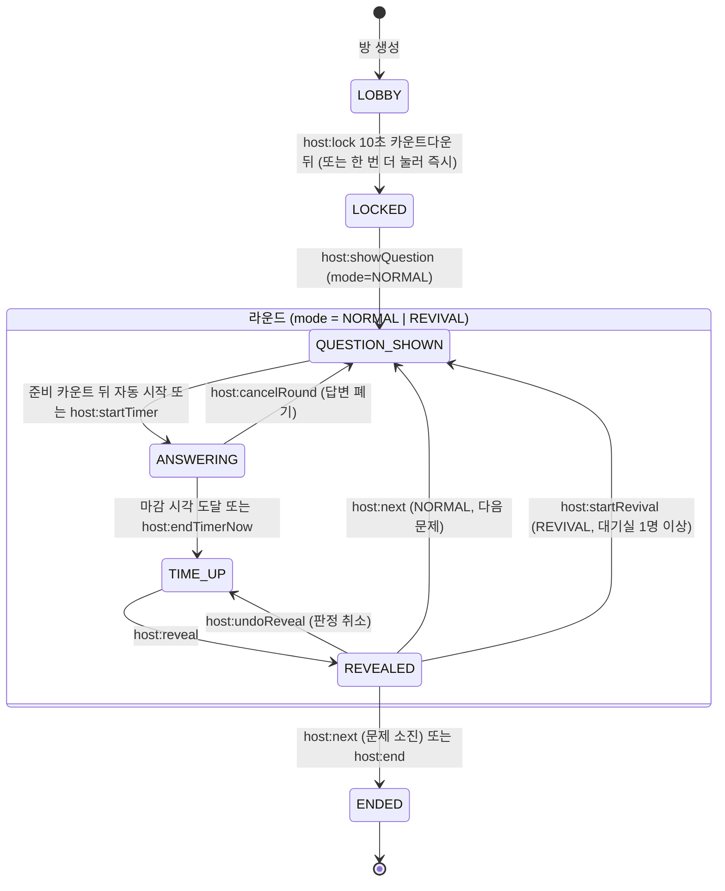
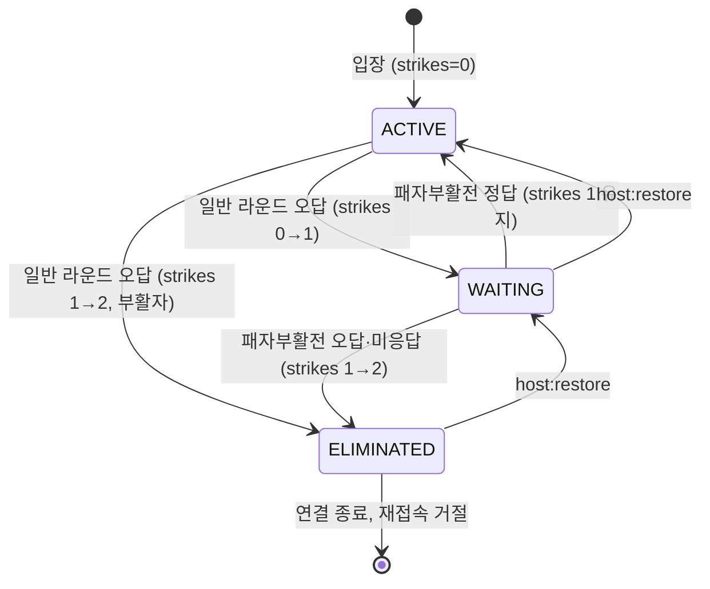
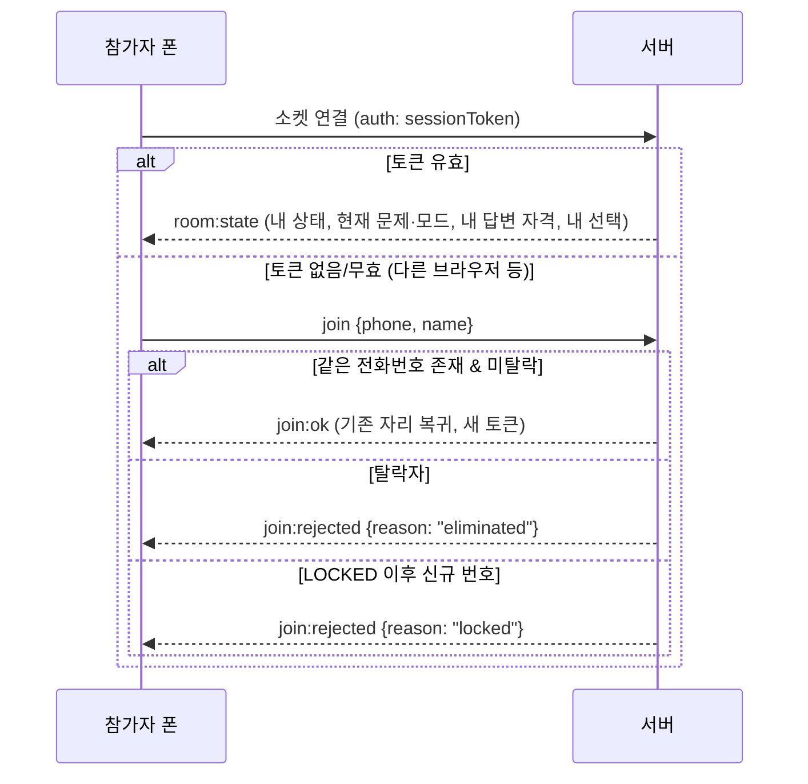

# 게임 진행 규칙과 상태 머신

## 책임

서버의 게임 엔진이 이 문서의 규칙을 그대로 구현한다. 방(게임) 상태 머신과 참가자 상태 머신 두 개가 있고, 사회자 명령·타이머 만료·참가자 답변이 전이를 일으킨다. 엔진은 화면을 모르고, 결과 이벤트만 [[realtime-protocol]]로 내보낸다.

> [!tip] 결정 (2026-09-16, 사회자)
> **대기실 참가자는 일반 문제에 답하지 않는다.** 관전만 하다가 사회자가 여는 **패자부활전**에서만 답하고, 맞히면 무대로 복귀, 틀리면 탈락한다. 오답은 어디서 하든 누적되어 **총 2회 = 탈락**이다. 따라서 부활한 참가자는 무대에서 한 번만 더 틀려도 대기실을 거치지 않고 바로 탈락한다.

## 라운드 모드

모든 문제는 두 모드 중 하나로 출제된다. 모드는 "누가 답할 수 있는가"만 바꾸고, 타이머·마감·정답 공개 절차는 같다.

| 모드 | 답하는 사람 | 관전하는 사람 | 오답·미응답 | 정답 |
|---|---|---|---|---|
| `NORMAL` 일반 라운드 | `ACTIVE` (무대) | `WAITING` (대기실) | 스트라이크 +1 → 1이면 대기실, 2이면 탈락 | 변화 없음 |
| `REVIVAL` 패자부활전 | `WAITING` (대기실) | `ACTIVE` (생존자석으로 내려감) | 스트라이크 +1 → 2이므로 탈락 | 무대 복귀 (`ACTIVE`) |

## 이동 표시 모드

아바타가 O/X 구역으로 뛰어가는 모습을 스크린에 **언제** 보여주는지도 서버가 정한다. 초반에는 눈치 답변을 허용해 분위기를 띄우고, 후반에는 막아 실력으로 가르기 위해서다.

| 문제 | 모드 | 스크린 | 서버가 스크린에 보내는 것 |
|---|---|---|---|
| 1번 ~ `liveMovesUntilOrderNo`+1번 (기본 4번까지) | 실시간 (`liveMoves: true`) | 선택 즉시 아바타가 해당 구역으로 걸어감 | `answer:moved { playerId, choice }` |
| 그 뒤 문제 (기본 5번부터) | 숨김 (`liveMoves: false`) | 아바타는 중앙에 머물고 선택한 사람에게 ✓ 배지만. 마감 순간 전원이 일제히 이동 | 답변 중에는 `answer:locked { playerId }`만, `TIME_UP`에 `choices` 전체 |

> [!tip] 결정 (2026-09-16, 사회자)
> 처음에는 실시간으로 보여주다가 5번 문제부터 숨긴다. 경계는 콘솔 설정으로 바꿀 수 있다. 패자부활전도 문제 번호 기준을 그대로 따른다(중반이면 대개 숨김 모드).

숨김 모드의 핵심은 **서버가 스크린 룸에 선택 방향을 마감 전까지 보내지 않는 것**이다. 스크린 클라이언트가 받아 놓고 숨기는 방식은 쓰지 않는다. 사회자 콘솔은 모드와 무관하게 항상 실시간 현황을 받는다.

## 방 상태 머신

| 상태 | 의미 | 스크린 | 참가자 폰 |
|---|---|---|---|
| `LOBBY` | 입장 접수 중. QR 코드 표시, 아바타가 무대를 돌아다님. 사회자가 마감을 누르면 **카운트다운(기본 10초)** 이 시작되지만 그동안에도 입장은 열려 있다 | 로비 화면 (+ 카운트다운 숫자) | 입장 폼 → 대기 화면 (+ "입장 마감까지 N초") |
| `LOCKED` | 입장 마감. 신규 등록 거절, 기존 참가자 재접속만 허용 | 로비 화면 + "곧 시작합니다" | 대기 화면 |
| `QUESTION_SHOWN` | 문제 지문 공개. 기본 설정에서는 준비 카운트(`autoStartDelaySec`, 기본 3초) 뒤 타이머가 **자동 시작**된다. 사회자는 "지금 시작"으로 건너뛸 수 있고, 설정(`autoStart`)을 끄면 수동. `REVIVAL`이면 무대 교대 연출 | 문제 화면, 3·2·1 준비 카운트 | 문제 표시, 버튼 잠김, "곧 시작 N" |
| `ANSWERING` | 타이머 진행. 자격 있는 참가자만 답변 접수. 아바타 이동은 `liveMoves`면 실시간, 아니면 ✓ 배지만 | 문제 + 카운트다운 + 이동(또는 배지) | 자격자: O/X 활성 / 관전자: 관전 안내 |
| `TIME_UP` | 마감. 답변 잠김. 숨김 모드였다면 이때 선택이 공개됨. O/X/미응답 인원 표시 | (숨김 모드: 일제 이동 →) 인원 카운트 연출 | "결과를 기다리세요" |
| `REVEALED` | 정답 공개, 스트라이크 적용, 이동·복귀·퇴장 연출 | 정답 강조 + 이동 연출 | 생존/대기실/부활/탈락 안내 |
| `ENDED` | 게임 종료. 생존자 발표. 최종 결승(추가 문제·가위바위보)은 앱 밖에서 진행하고 `host:setWinner`로 우승자만 표시 | 최종 생존자 화면 → 우승자 왕관 | 종료 화면 / 우승자는 축하 화면 |

> [!tip] 결정 (2026-09-17, 사회자)
> **1번 문제는 맛보기다.** 틀려도 스트라이크가 오르지 않아 아무도 떨어지지 않는다. 참가자가 버튼과 규칙을 몸으로 익히는 라운드이며, 화면에 "맛보기 문제 · 틀려도 탈락하지 않아요"라고 알린다. 범위는 설정(`practiceUntilOrderNo`, 기본 0 = 1번까지)으로 바꾸고, 0으로 두면 맛보기가 없다. 패자부활전은 맛보기가 되지 않는다.

> [!tip] 결정 (2026-09-17, 사회자)
> **입장 마감은 10초 카운트다운 뒤에 이뤄진다.** 사회자가 "입장 마감 카운트다운"을 누르면 스크린에 큰 숫자가 뜨고(마지막 5초는 틱 소리), 그동안에도 **입장은 계속 열려 있어** 막판 참가자가 들어올 수 있다. 버튼을 한 번 더 누르면 즉시 마감, "마감 취소"로 되돌릴 수 있다. 카운트다운 길이는 설정에서 바꾸며 0이면 누르는 즉시 마감된다.

> [!tip] 결정 (2026-09-17, 사회자)
> **문제를 내면 타이머가 자동으로 시작된다.** 서버가 문제 공개 시각 + 준비 카운트에 `startTimer`를 예약하며, 그 사이 사회자가 직접 시작하거나 문제를 바꾸거나 라운드를 취소하면 예약은 무효가 된다. 라운드 취소와 서버 재시작 뒤에는 사고 대응 중일 수 있으므로 자동 시작하지 않는다.

> [!tip] 결정
> `LOCKED`를 `LOBBY`와 분리한 이유는 "당연히 중간에 들어오는 건 없다"는 규칙을 코드 한 곳(등록 API가 `LOBBY`에서만 열림)에서 강제하기 위해서다. 패자부활전을 별도 상태가 아니라 라운드의 `mode` 속성으로 둔 이유는 타이머·마감·되돌리기 코드를 두 번 짜지 않기 위해서다.

## 참가자 상태 머신

| 상태 | 스트라이크 | 일반 라운드 | 패자부활전 | 위치(스크린) |
|---|---|---|---|---|
| `ACTIVE` | 0, 또는 1(부활자) | 답함 | 관전 (생존자석) | 메인 무대 중앙 → O/X 구역 |
| `WAITING` | 1 | 관전 (대기실) | 답함 (무대로 올라옴) | 대기실 띠 (무대 하단) |
| `ELIMINATED` | 2 | — | — | 표시 안 함. 퇴장 연출 후 사라짐, 소켓 강제 종료 |

접속 여부(`connected`)는 위 상태와 별개의 축이다. 끊겨 있어도 `ACTIVE`/`WAITING`은 유지되며, 자격 있는 라운드에서 미응답으로 처리될 뿐이다.

> [!tip] 결정 (2026-09-16, 사회자)
> 부활 시 스트라이크는 **1을 유지**한다. 새 목숨을 주지 않으므로 부활자는 무대에서 다음 오답에 곧바로 탈락한다. "총 2회 틀리면 나간다"는 규칙이 어디서나 그대로 적용되며, 초기화 옵션은 만들지 않는다.

## 판정 규칙

정답 공개 시 엔진은 **이번 라운드 자격자**에 대해서만 아래를 적용한다. 관전자는 아무 영향이 없다.

| 규칙 | 기본값 | 설정 가능 |
|---|---|---|
| 답변 자격 | `NORMAL`은 `ACTIVE`, `REVIVAL`은 `WAITING`. 자격 없는 참가자의 답은 무시(ack 없음) | 아니오 |
| 답변 변경 | 마감 전까지 무제한, **마지막 선택**이 답 | 아니오 |
| 답변 변경 속도 제한 | 참가자당 300ms에 1회. 초과분은 무시 | 예 |
| 마감 유예 | 서버 마감 시각 + **1초**까지 도착한 답은 인정. 화면 카운트다운은 마감 시각에 0이 되지만 **서버는 유예만큼 기다렸다가 집계**하므로, 네트워크가 느린 참가자가 0초 직전에 누른 답도 살아난다 | 예 (`answerGraceMs`) |
| 미응답 | 오답 처리 → 스트라이크 +1 (확정 규칙, 2026-09-16) | 아니오 |
| 맛보기 문제 | `practiceUntilOrderNo`(기본 0) 이하의 일반 문제는 틀려도 스트라이크가 오르지 않는다. 결과 이벤트에 `practice: true`가 실려 화면이 "맛보기라 통과"를 띄운다 | 예 |
| 오답 결과 | 맛보기가 아니면 `strikes += 1`; `strikes >= maxStrikes`면 `ELIMINATED`, 아니면 `WAITING` | `maxStrikes` (기본 2) |
| 정답 결과 | `NORMAL`: 변화 없음. `REVIVAL`: `ACTIVE`로 복귀, 스트라이크 1 유지(다음 오답에 즉시 탈락) | 아니오 |
| 퇴장 처리 | 정답 공개 이벤트 전송 후 3초 뒤 소켓 종료. 폰은 탈락 화면 고정. 같은 전화번호 재접속 시 "탈락 처리되었습니다" 안내 | 아니오 |
| 정답 공개 순서 | ① 정답 표시 ② 자격자 결과 확정 ③ 스트라이크·상태 적용 ④ 스냅샷 저장 ⑤ 이벤트 전송 | 아니오 |

## 패자부활전

| 항목 | 규칙 |
|---|---|
| 시작 조건 | 방 상태 `REVEALED`(직전 라운드 정리 완료) 이고 `WAITING`이 1명 이상. 0명이면 콘솔 버튼 비활성 + `host:alert` |
| 문제 선택 | 문제 은행에서 `kind = REVIVAL`로 표시해 둔 문제를 우선 제안하고, 사회자가 다른 미출제 문제를 골라도 된다. 출제된 문제는 모드와 무관하게 소진된다 |
| 횟수·시점 | **중반 1회**(사회자 결정). 콘솔 설정 `revivalAfterOrderNo`(기본: 전체 문제의 절반 지점, 10문제면 5번 뒤)에 예정 시점을 두고, 그 문제의 정답 공개 뒤 "다음 단계" 버튼이 "패자부활전 시작"으로 바뀐다. 예정 외 추가 부활전은 비상용(무대 생존자 0명 등)으로만 허용하며 `force` 플래그와 콘솔 2단계 확인이 필요하다 |
| 결과 | 정답자는 `ACTIVE`로 무대 복귀(스트라이크 1 유지), 오답·미응답자는 `ELIMINATED` |
| 연출 | `QUESTION_SHOWN(REVIVAL)` 진입 시 무대 교대: `ACTIVE` 아바타가 하단 띠(생존자석으로 이름 바뀜)로 내려가고 `WAITING` 아바타가 무대로 올라온다. 정답 공개 후 부활자는 무대에 남고 탈락자는 사라진다. 다음 일반 라운드 진입 시 생존자가 다시 무대로 올라온다 → [[screens]] |
| 참가자 폰 | `WAITING`: "패자부활전! 맞히면 복귀, 틀리면 탈락" 배너 + O/X 활성. `ACTIVE`: "패자부활전 진행 중 · 관전" 화면, 버튼 없음 |
| 되돌리기 | `host:undoReveal`은 일반 라운드와 같다. 부활자는 `WAITING`으로, 탈락자는 `WAITING`으로 스냅샷 복원 |

## 결승 규칙 (생존자가 결승 인원 이하)

> [!tip] 결정 (2026-09-17, 사회자)
> 무대 생존자가 **3명 이하**가 되면 게임을 멈추고 결승 진출자를 축하 화면으로 발표한다. 결승(추가 문제·가위바위보)은 무대에서 진행한다. 단, **패자부활전을 아직 열지 않았고 대기실에 사람이 있으면 패자부활전을 먼저** 진행하고 그 결과로 다시 판단한다.

| 상황(정답 공개 직후) | 동작 |
|---|---|
| 생존자 > 결승 인원(`finalistThreshold`, 기본 3) | 평소처럼 다음 문제 |
| 생존자 ≤ 결승 인원이고 부활전 미사용·대기실 1명 이상 | `pendingRevival = true`. 콘솔 큰 버튼이 "패자부활전 시작"으로 바뀌고 스크린에 "잠시 후 패자부활전" 자막 |
| 생존자 ≤ 결승 인원이고 그 외(부활전을 이미 했거나 대기실 0명) | `finaleAt = 6초 뒤`로 예약해 자동으로 `ENDED`. 스크린은 "🎉 축하합니다!"와 결승 진출자의 이름·**휴대폰 뒷번호 4자리**를 크게 표시 |
| 생존자 0명 | 자동 전환 없음. 콘솔 경고(판정 취소·비상 부활전·종료 중 선택) |

- 6초 안에 사회자가 "다음 문제"나 "판정 취소"를 누르면 예약은 무효가 되고, "지금 발표"로 바로 넘어갈 수도 있다. 서버 재시작 뒤에도 예약은 사라진다.
- 결승 진출자 카드는 `ENDED`이고 생존자가 결승 인원 이하일 때만 뜬다. 인원이 더 많은 상태에서 수동 종료하면 예전처럼 생존자 명단만 나온다.
- 뒷번호 4자리는 무대에서 본인을 호명하기 위한 것으로, 사회자 결정에 따라 **결승 화면에서만** 스크린에 노출한다. [[ADR-0003-phone-identity]]의 "스크린 노출 금지" 원칙의 유일한 예외이며, 그 외 어떤 화면·이벤트에도 전화번호 조각이 실리지 않는다.
- 결승 인원을 0으로 두면 규칙이 꺼진다. 게임 중에도 바꿀 수 있다.

## 되돌리기와 수동 개입

| 명령 | 가능한 상태 | 동작 |
|---|---|---|
| `host:undoReveal` | `REVEALED` | 직전 정답 공개를 취소한다. 스트라이크·상태를 공개 직전 스냅샷으로 되돌리고, 이미 끊긴 탈락자는 재접속을 다시 허용한다. 상태는 `TIME_UP`으로 돌아가 정답을 바꿔 다시 공개할 수 있다 |
| `host:cancelRound` | `ANSWERING`, `TIME_UP` | 이번 문제의 답변을 모두 버리고 `QUESTION_SHOWN`(같은 모드)으로 돌아간다. 네트워크 장애로 다수가 못 답했을 때 사용 |
| `host:restore {playerId}` | 언제나 | 스트라이크를 1 줄이고 상태를 한 단계 되돌린다(`ELIMINATED→WAITING`, `WAITING→ACTIVE`). 탈락자에게는 재접속을 다시 허용한다 |
| `host:kick {playerId}` | 언제나 | 즉시 `ELIMINATED`로 만든다(대리 응답 등 부정행위) |

되돌리기를 위해 엔진은 정답 공개 직전 상태를 라운드마다 스냅샷으로 보관한다([[data-model]]의 `round_results.snapshot_before`).

## 재접속 흐름

`ANSWERING` 중에 복귀하면 서버가 마감 시각·현재 선택·답변 자격을 함께 보내 자격자는 곧바로 이어서 답할 수 있다.

## 예외 상황

| 상황 | 동작 |
|---|---|
| 일반 라운드 정답 공개로 무대 생존자가 0명 | 자동 종료하지 않고 콘솔에 경고. 대기실이 있으면 **패자부활전으로 이어가기**를 제안하고, 없으면 `undoReveal` 또는 `ENDED` |
| 패자부활전에서 전원 탈락 | 무대 생존자가 그대로 진행. 생존자도 0명이면 위와 같음 |
| 패자부활전에서 전원 부활 | 정상. 모두 무대로 올라와 다음 일반 라운드 진행 |
| 생존자가 1명 | 콘솔에 "우승자 결정" 배지. `host:end`로 종료하면 곧바로 우승 연출 |
| 문제를 다 썼는데 생존자 다수 | `host:end`로 종료해 생존자 명단을 띄우고, 사회자가 무대로 불러 추가 문제나 가위바위보로 결승을 진행한다(앱 밖). 끝나면 `host:setWinner`로 왕관. 즉석 문제를 앱으로 계속 내는 것도 가능 |
| 답변 중 서버 재시작 | 기동 시 마지막 스냅샷 복구. `ANSWERING`이었다면 같은 모드의 `QUESTION_SHOWN`으로 강등하고 사회자에게 알림 |
| 자격자 폰이 마감 직전에 끊김 | 마지막으로 서버가 받은 선택이 답. 아무 것도 없으면 미응답 |
| 스크린 브라우저가 끊김 | 재접속 시 `room:state` 전체를 받아 현재 모드·상태부터 다시 그림. 이동 연출은 생략하고 최종 위치에 바로 배치 |

## 의존성

- [[realtime-protocol]] — 여기의 전이마다 나가는 이벤트와 `mode`·`liveMoves` 필드, `answer:locked`, `host:setWinner`
- [[data-model]] — `questions.kind`, `rooms.round_mode`, 스냅샷 저장 구조
- [[screens]] — 패자부활전 무대 교대 연출
